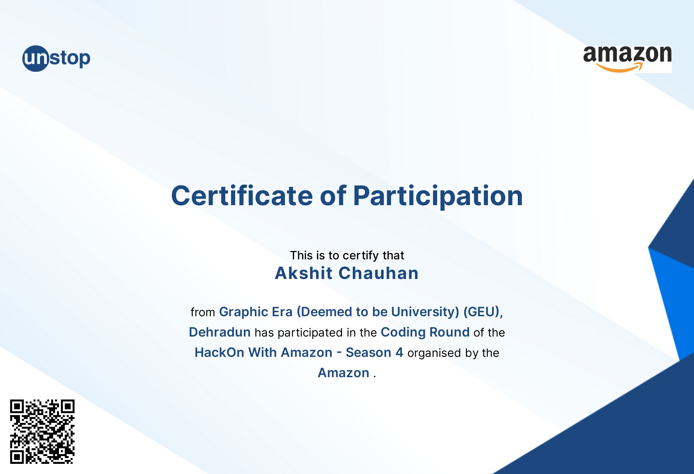
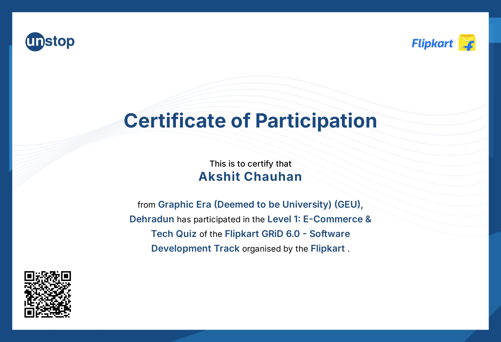
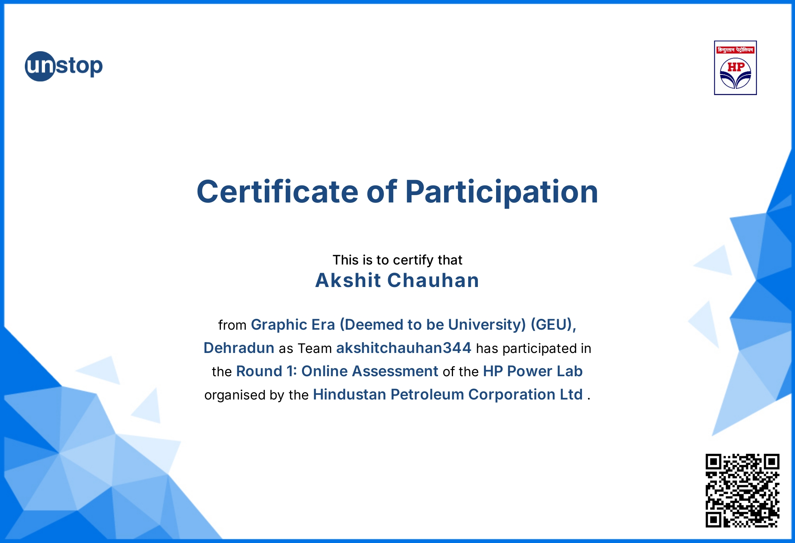
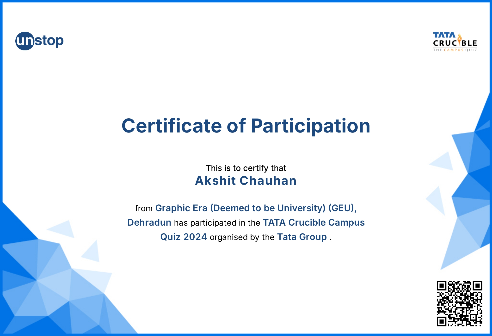
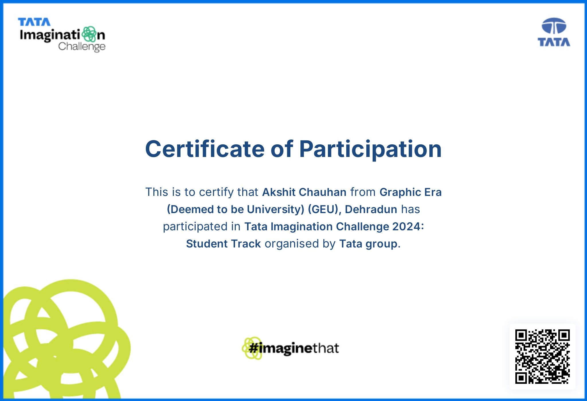
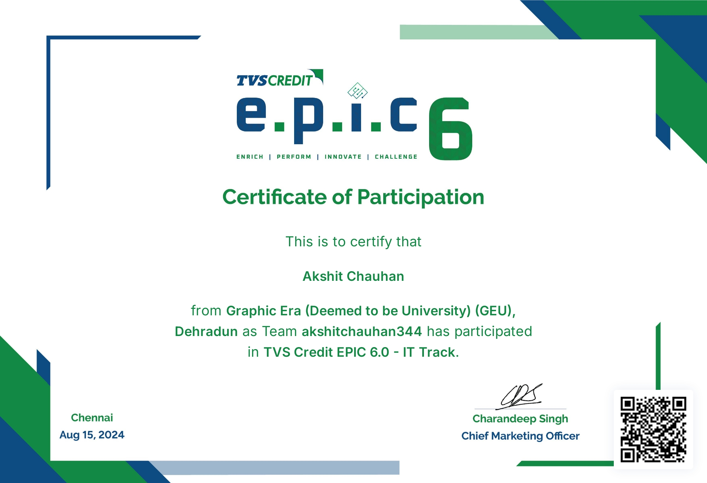

# My-Portfolio-Website
Welcome to my personal portfolio website repository! This project serves as a digital showcase of my skills, projects, certifications, and academic journey in the fields of web development, machine learning, and software engineering.
<!DOCTYPE html>
<html lang="en">
<head>
    <meta charset="UTF-8">
    <meta name="viewport" content="width=device-width, initial-scale=1.0">
    <title>Akshit Chauhan - Portfolio</title>
    <link rel="stylesheet" href="styles.css">
    
</head>
<body>

    <header>
        <nav>
            <button>Menu</button> 
        </nav>
    </header>

    

        
        

            
        

        

            <h1>Akshit Chauhan</h1>
            

                <a href="https://www.linkedin.com/in/akshit-chauhan-238052288" >LinkedIn</a> - 
                <a href="https://www.instagram.com/_.akshit_chauhan._/" >Instagram</a>-
                <a href="https://github.com/AkshitChauhan011110/Akshit-Chauhan">GitHub</a>
                <h3>akshitchauhan344@gmail.com</h3>
                
            

        

        
    

    

        <h2>Education</h2> 
        <table>
            <tr>
                <td>
                    Degree
                </td>
                <td>
                    Institute
                </td>
                <td>
                    Year
                </td>
                <td>
                    Result
                </td>
            </tr>
            <tr>
                <td>
                    B.Tech (CSE)
                </td>
                <td>
                    Graphic Era Hill University
                </td>
                <td>
                    2022-2026
                </td>
                <td>
                    7.7475 / 10
                </td>
            </tr>
            <tr>
                <td>
                    XII
                </td>
                <td>
                    Baluni Public School
                </td>
                <td>
                    2021
                </td>
                <td>
                    77.8%
                </td>
            </tr>
            <tr>
                <td>
                    X
                </td>
                <td>
                    Doon's Pride Public School
                </td>
                <td>
                    2019
                </td>
                <td>
                    78.16%
                </td>
            </tr>
        </table>
    

    

        <h2>Technical Skills</h2>
        <ul>
            <li><strong>Programming Languages:</strong> C, C++, Java, Python, JavaScript, SQL</li>
            <li><strong>Web Development:</strong> HTML, CSS, JavaScript</li>
            <li><strong>Tools & Libraries:</strong> Visual Studio Code, GitHub, Code Blocks, Pandas, NumPy, TensorFlow.js, Web Speech API</li>
            <li><strong>Operating Systems:</strong> Linux, Windows</li>
            <li><strong>Frameworks/Other:</strong> Java Swing, File Handling, Object Detection</li>
        </ul>
    

    

        <h2>Projects</h2> 
        

            

                <h3>Dynamic Web Application for University</h3>
                
Built a web application for Graphic Era Hill University, focusing on enhancing user experience with features
                    such as image display and dropdown menus.

            

            

                <h3>Object Detection and Voice Feedback System</h3>
                
Designed and developed a real-time object detection system using TensorFlow.js and integrated a voice feedback
                    system through the Web Speech API.

            

            

                <h3>Course Recommendation System</h3>
                
Designed and implemented a machine learning model using RandomForestClassifier to recommend courses
                    based on high school marks, subjects, and hobbies.

            

        

    

    

    <h2>Certifications</h2>
    

        
        
        
        
        
        
    

</body>
</html>
